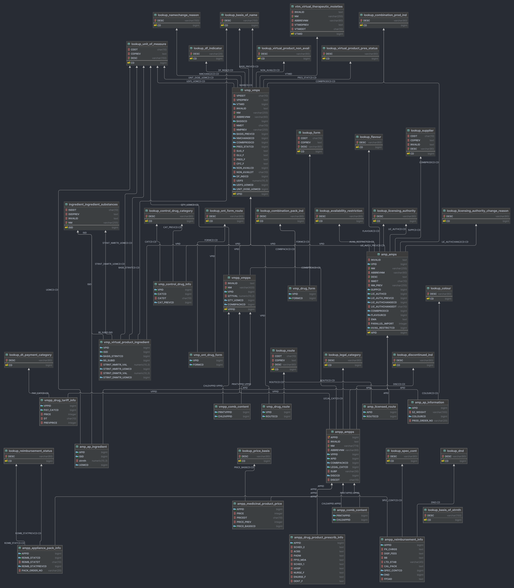

NHS Dictionary of medicines and devices (dm+d) Postgres SQL parser

These Python and Postgres SQL scripts are used to parse the dm+d releases in XML format into a Postgres database.
Relational fields are referenced together using foreign keys, and the description of the columns are stored in their comments.

You can download the official releases of dm+d for free from https://isd.digital.nhs.uk.

## Usage
1. Install PostgresSQL server, unzip the dm+d releases into a folder and clone this repo.
2. Run `pip install -r requirements.txt` to install the required Python packages.
3. Run `python parser.py -u [your postgres username] -p [your postgres password] -d [relative or absolute path to the directory containing the dm+d folders]`

# Database ERD

